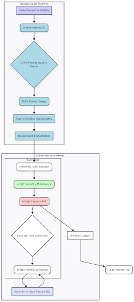
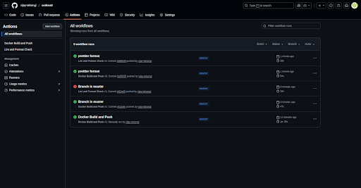
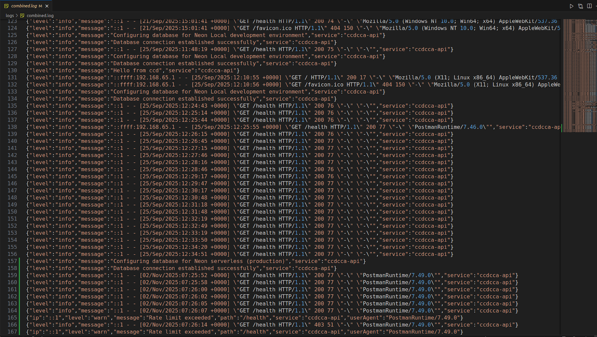
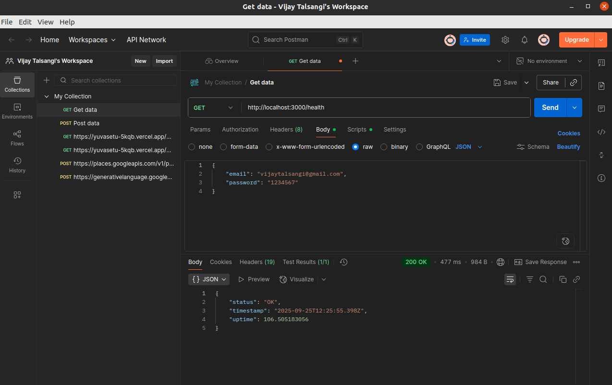
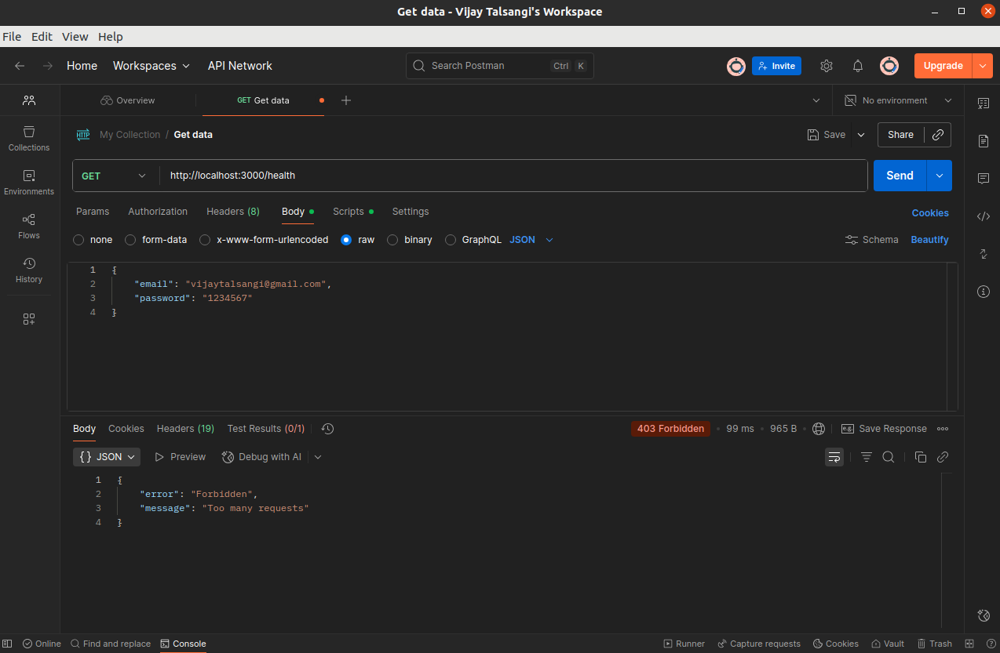

# 🌩️ Cloud-Native Continuous Deployment and Advanced Security for a Modern API

---

<!-- Badges -->
<p align="left">
  
  
  
  
  
</p>

---

## 📌 Abstract

This repository contains a modular Node.js API that demonstrates a cloud-native CI/CD pipeline, serverless PostgreSQL (Neon), Drizzle ORM migrations, Docker multi-stage builds, GitHub Actions workflows, and an Arcjet security middleware integration. The goal is secure, fast, reproducible deployments with strong observability.

---

## 🔷 Architecture Diagram



---

## 🔧 DevOps / CI-CD Diagram



---

## 📸 Logs / Runtime Screenshot



---

## Postman Testing of Api

Usual response.



When limit exceeded.



---

## 🗂 Project Overview

**Stack & Tools**

- Runtime: **Node.js** + **Express.js**
- Database: **Neon (Serverless PostgreSQL)**
- ORM: **Drizzle ORM** (TypeScript-first schema + migrations)
- Containerization: **Docker** (multi-stage, multi-platform builds)
- CI/CD: **GitHub Actions** (`lint-and-format.yml`, `docker-build-and-push.yml`)
- Security: **Arcjet middleware** (rate limiting, bot detection)
- Auth: **JWT** via HTTP-only secure cookies
- Logging: **Winston** + **Morgan**
- Validation / Quality: **Zod**, **ESLint**, **Prettier**

---

## 🔁 DevOps Pipeline Flow

Code Commit → GitHub Actions (Lint, Format, Build) → Docker Build (multi-platform) →
Push to Docker Hub → Production Deploy (docker-compose / orchestrator) → Monitoring (Arcjet + Winston)

---


> **Place the deployment flow image at** `./assets/deployment.png` if you have one.

---

## ⚙️ Features Implemented

- User Authentication endpoints:
  - `POST /api/auth/sign-up`
  - `POST /api/auth/sign-in`
  - `POST /api/auth/sign-out`
- Role-based access (Admin / User / Guest)
- Rate limiting per role using Arcjet
- Drizzle-managed database schema + migrations
- Docker healthchecks for container orchestration
- Logging to `logs/` and console with Winston + Morgan
- ESLint + Prettier enforcement in CI

---

## 📋 Database Schema (summary)

**users table** (sample fields)

- `id` (PK)
- `name`
- `email` (unique)
- `password` (bcrypt-hashed)
- `role`
- `created_at`, `updated_at`

---

## 🧪 Metrics (Observed / Reported)

| Metric               | Traditional | Cloud + DevOps | Improvement    |
| -------------------- | ----------- | -------------- | -------------- |
| Deployment Time      | 45 mins     | 8 mins         | **82% faster** |
| Error Recovery       | 30 mins     | 5 mins         | **83% faster** |
| Resource Utilization | 55%         | 80%            | **+25%**       |

---

## 🛠️ How to run locally (development)

1. Clone:

```bash
git clone https://github.com/vijay-talsangi/ccdcca2.git

cd ccdcca2
```

2. Install:

```bash

npm install

```

3. Start dev stack using Docker Compose (Neon local proxy used for local dev):

```bash

docker compose -f docker-compose.dev.yml up --build

```

4. Visit: http://localhost:3000 (port set in .env / compose file)
